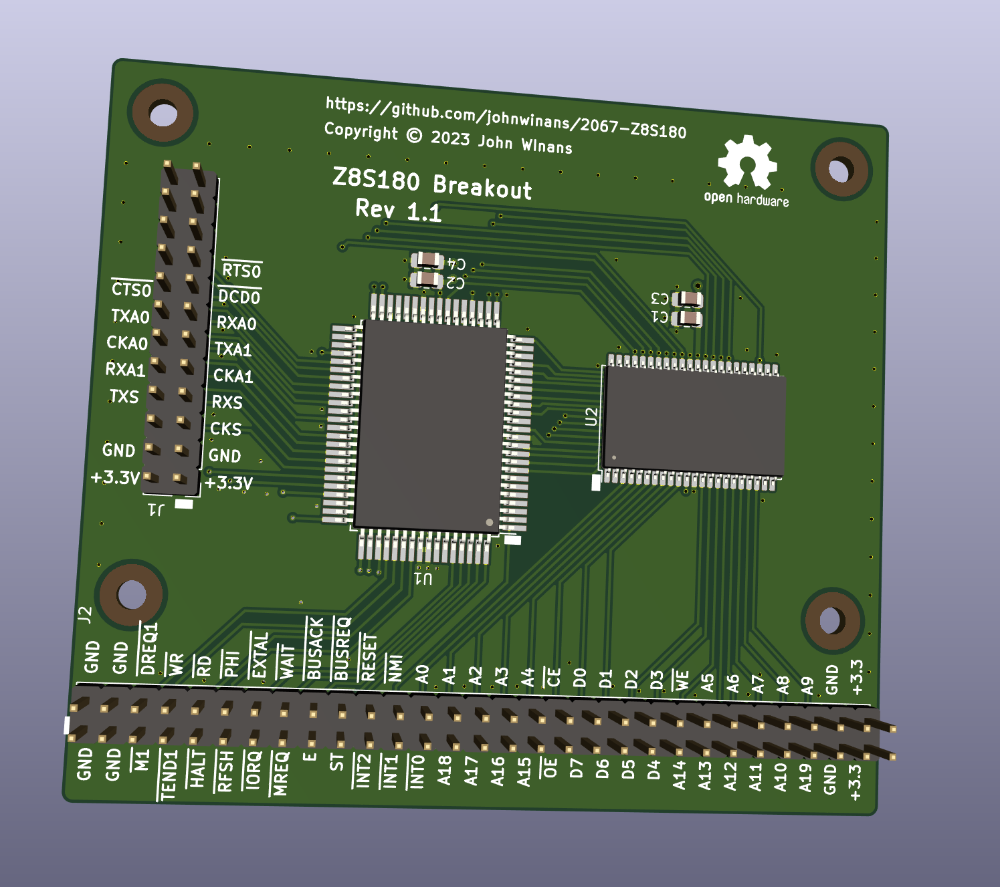

# 2067-Z8S180
Z8S180 Breakout Board

- There is a YouTube playlist that discusses the [Z80-Nouveau](https://www.youtube.com/playlist?list=PL3by7evD3F52rUbThUNDYGxNpKFF1HCNT) project for which this board is an early prototype.
- There is a [Verilog/FPGA YouTube tutorial series](https://www.youtube.com/playlist?list=PL3by7evD3F52On-ws9pcdQuEL-rYbNNFB)
- [Verilog examples](https://github.com/johnwinans/Verilog-Examples) that go along with the above YouTube tutorial.
- This board plugs into the [2057-ICE40HX4K-TQ144-breakout](https://github.com/johnwinans/2057-ICE40HX4K-TQ144-breakout) board.

# Useful DOC

- [Schematic PDF](./2067-Z8S180.pdf)
- [Latest release with gerbers](https://github.com/johnwinans/2067-Z8S180/releases/latest)
- [Z80 CPU User Manual UM008011](https://www.zilog.com/docs/z80/um0080.pdf)
- [Z8S180 Manuals](https://zilog.com/index.php?option=com_product&Itemid=26&task=docs&businessLine=&parent_id=139&familyId=19&productId=Z8S180)
    - [Z8S180 DS0060 - Product Specification](https://www.zilog.com/docs/z180/z8s180ps.pdf)
    - [Z80180 UM0050 - User Manual](https://www.zilog.com/docs/z180/um0050.pdf)

# Revision History

## 1.1 Change CPU footprint to make the pads longer
- add mounting holes
- add labels to the pins on J2

## 1.2 Thermal Relief
- reduce spoke widths
- keep polygon pours off the CPU GND pins
- Connect SRAM A20 to GND w/cuttable track
